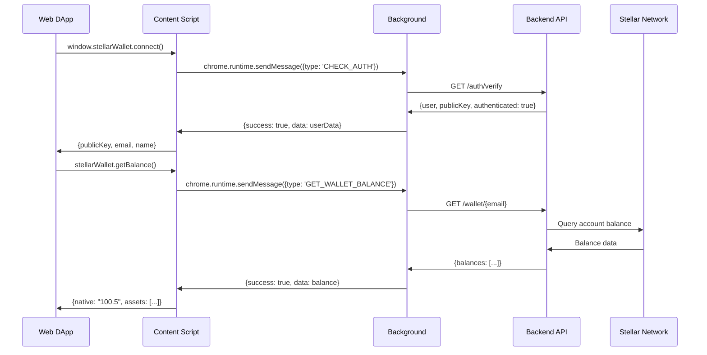

# Adescentralized – Browser Extension (Web3 Wallet Provider)

**A TypeScript-powered browser extension that enables seamless Web3 integration with Stellar blockchain for the Adescentralized advertising ecosystem.**

> Part of the **Adescentralized** ecosystem — a comprehensive Web3 advertising platform with wallet provider functionality, ad revenue tracking, and integrated payment solutions.

---

## 0) Introduction & Context

The Adescentralized Browser Extension serves as the critical Web3 bridge between users and the decentralized advertising platform. It provides:

* **Wallet Provider API**: Enables websites to interact with Stellar accounts seamlessly
* **Revenue Tracking**: Real-time monitoring of ad interaction earnings
* **Payment Management**: Integrated withdrawal system with multiple payment methods
* **Cross-Platform Support**: Compatible with Chrome and Firefox browsers
* **Privacy-First**: Backend API integration without exposing private keys

This extension eliminates the dependency on Freighter wallet while providing a superior user experience with built-in revenue tracking and payment capabilities.

---

## 1) System Architecture

### 1.1 Extension Components

1. **Background Script** (`background/`) – Service worker handling authentication and API communication
2. **Content Script** (`content/`) – Injects wallet provider API into web pages
3. **Popup Interface** (`popup/`) – React-based user interface for wallet management
4. **Wallet Provider** (`wallet-provider.js`) – Standard Web3 wallet interface for DApps

### 1.2 Actor Roles

* **Extension User**: Individual with browser extension installed for ad revenue tracking
* **Website Developer**: Integrates Stellar wallet functionality into their web application
* **Backend API**: Handles authentication, balance queries, and transaction processing
* **Stellar Network**: Processes actual blockchain transactions

### 1.3 High-Level Architecture Flow

```mermaid
graph TB
    subgraph "Browser Extension"
        BG[Background Script]
        CS[Content Script]
        UI[Popup UI]
        WP[Wallet Provider]
    end

    subgraph "Web Page"
        DApp[DApp/Website]
        API[Window API]
    end

    subgraph "Backend Services"
        AUTH[Authentication API]
        WALLET[Wallet API]
        STELLAR[Stellar Network]
    end

    DApp -->|wallet.connect()| API
    API -->|postMessage| CS
    CS -->|chrome.runtime| BG
    BG -->|HTTP Request| AUTH
    AUTH -->|Validate| WALLET
    WALLET -->|Transaction| STELLAR

    UI -->|User Input| BG
    BG -->|Response| CS
    CS -->|postMessage| API
    API -->|Promise Resolve| DApp

    classDef extension fill:#e3f2fd,stroke:#1976d2,stroke-width:2px;
    classDef backend fill:#f3e5f5,stroke:#7b1fa2,stroke-width:2px;
    classDef web fill:#e8f5e8,stroke:#388e3c,stroke-width:2px;
    
    class BG,CS,UI,WP extension;
    class AUTH,WALLET,STELLAR backend;
    class DApp,API web;
```

### 1.4 Message Flow Architecture



---

## 2) Core Features & Components

### 2.1 Browser Extension Core (`src/`)

**Manifest V3 Architecture with TypeScript**

#### Background Service Worker
* **Authentication Management**: JWT token storage and validation
* **API Communication**: Secure communication with backend services
* **Cross-Tab Synchronization**: Maintains consistent state across browser tabs
* **Event Handling**: Processes messages from content scripts and popup

#### Content Script Injection
* **Wallet Provider API**: Injects `window.stellarWallet` for DApp integration
* **Event Management**: Handles communication between web pages and extension
* **CSP Compliance**: Uses `postMessage` API to avoid Content Security Policy issues
* **Auto-Detection**: Provides `isStellarWalletInstalled` global flag

#### Popup Interface (React)
* **Multi-Page Navigation**: Login, Balance, Statistics, Withdrawal pages
* **Real-Time Updates**: Live balance refresh and revenue tracking
* **Form Validation**: Client-side validation for all user inputs
* **Error Handling**: Comprehensive error display and recovery mechanisms

### 2.2 Wallet Provider Interface

**Standard Web3 Wallet API Implementation**

```typescript
interface StellarWalletProvider {
  // Connection Management
  connect(): Promise<{publicKey: string, email: string, name: string}>;
  disconnect(): void;
  isWalletConnected(): boolean;
  
  // Account Operations
  getPublicKey(): Promise<string>;
  getBalance(): Promise<{native: string, assets: Asset[]}>;
  
  // Transaction Operations
  sendPayment(destination: string, amount: string, memo?: string): Promise<TransactionResult>;
  signTransaction(xdr: string): Promise<string>;
  
  // Event System
  on(event: string, callback: Function): void;
  off(event: string, callback: Function): void;
}
```

#### Supported Events
* `connect`: Wallet successfully connected
* `disconnect`: Wallet disconnected
* `accountsChanged`: Active account changed
* `extensionDetected`: Extension installation detected

### 2.3 Revenue Tracking System

**Integrated Ad Revenue Monitoring**

* **Real-Time Statistics**: Total ads viewed, revenue earned, monthly/daily breakdowns
* **Backend Integration**: Syncs with Adescentralized platform for accurate tracking
* **Payment History**: Complete transaction log with timestamps and amounts
* **Performance Metrics**: Click-through rates and engagement analytics

---

## 3) Tech Stack & Dependencies

### 3.1 Core Technologies
* **TypeScript 5.3+**: Full type safety and modern JavaScript features
* **React 18**: Component-based UI with hooks and functional components
* **Webpack 5**: Module bundling with optimization for extensions
* **Chrome Extension APIs**: Manifest V3 with service workers

### 3.2 Key Dependencies
```json
{
  "stellar-sdk": "^11.3.0",        // Stellar blockchain integration
  "axios": "^1.6.0",              // HTTP client for API requests
  "react": "^18.2.0",             // UI framework
  "react-dom": "^18.2.0",         // React DOM rendering
  "@types/chrome": "^0.0.254"     // Chrome extension type definitions
}
```

### 3.3 Development Tools
* **ESLint + TypeScript ESLint**: Code quality and consistency
* **CSS Loaders**: External stylesheet support (no inline styles)
* **Sharp**: Icon generation for different extension sizes
* **Jest**: Unit testing framework

---

## 4) Project Structure

```
Adescentralized-Browser-Extension/
├─ public/                          # Static assets and manifest
│  ├─ manifest.json                 # Extension configuration
│  ├─ wallet-provider.js           # Standalone wallet provider
│  └─ icon.png                     # Source icon for generation
├─ src/                            # TypeScript source code
│  ├─ background/                  # Service worker
│  │  └─ backend-only.ts           # Authentication & API handling
│  ├─ content/                     # Content script injection
│  │  └─ index.ts                  # Wallet provider injection logic
│  ├─ popup/                       # React-based user interface
│  │  ├─ pages/                    # Individual page components
│  │  │  ├─ Balance/               # Wallet balance display
│  │  │  ├─ Login/                 # Authentication interface
│  │  │  ├─ Stats/                 # Ad revenue statistics
│  │  │  └─ Withdraw/              # Payment withdrawal system
│  │  ├─ App.tsx                   # Main application component
│  │  ├─ index.tsx                 # React app entry point
│  │  └─ popup.html                # HTML template
│  ├─ types/                       # TypeScript type definitions
│  │  └─ index.ts                  # Shared interfaces
│  └─ utils/                       # Utility functions
│     ├─ api.ts                    # Backend API integration
│     └─ auth.ts                   # Authentication management
├─ debug.js                        # Browser console debugging tool
├─ wallet-demo.html                # Developer integration example
├─ wallet-test.html                # Extension testing interface
├─ webpack.config.js               # Build configuration
├─ tsconfig.json                   # TypeScript configuration
└─ package.json                    # Dependencies and scripts
```

---

## 5) Getting Started

### 5.1 Prerequisites

* **Node.js 16+** with npm package manager
* **Chrome or Firefox** browser for development testing
* **Backend API** running on localhost:3000 (Adescentralized platform)
* **TypeScript knowledge** for customization and extension

### 5.2 Installation & Build

```bash
# Clone the repository
git clone <repository-url>
cd Adescentralized-Browser-Extension

# Install dependencies
npm install

# Build for development (with file watching)
npm run dev

# Build for production
npm run build
```

### 5.3 Browser Installation

**Chrome Development Installation:**
```bash
# After running npm run build
# 1. Open Chrome -> chrome://extensions/
# 2. Enable "Developer mode"
# 3. Click "Load unpacked"
# 4. Select the 'dist' folder
```

**Firefox Development Installation:**
```bash
# After running npm run build
# 1. Open Firefox -> about:debugging
# 2. Click "This Firefox"
# 3. Click "Load Temporary Add-on"
# 4. Select manifest.json from 'dist' folder
```

### 5.4 Development Configuration

```typescript
// Configure API endpoint in src/utils/api.ts
const API_BASE_URL = 'http://localhost:3000';

// Set authentication URL in src/utils/auth.ts
const LOGIN_URL = 'https://your-platform.com/login';
```

---

## 6) API Integration Guide

### 6.1 Backend API Endpoints

```typescript
// Authentication
POST /wallet/login              // User login with email/password
POST /wallet/                   // Create new user account
GET  /wallet/{email}            // Get wallet data and balance

// Transactions
POST /transfer                  // Create Stellar payment transaction

// Analytics
GET  /dashboard/{userId}        // User statistics and campaign data
```

### 6.2 Request/Response Examples

**User Login:**
```typescript
// Request
POST /wallet/login
{
  "email": "user@example.com",
  "password": "securepassword"
}

// Response
{
  "message": "Login successful",
  "token": "jwt-token-here",
  "user": {
    "id": "user-id",
    "email": "user@example.com",
    "name": "User Name",
    "publicKey": "GXXXXXXXXXXXXXXX",
    "userType": "advertiser"
  }
}
```

**Get Balance:**
```typescript
// Response
{
  "publicKey": "GXXXXXXXXXXXXXXX",
  "balances": [
    {"type": "native", "balance": "100.5000000"},
    {"type": "credit_alphanum4", "asset_code": "USDC", "balance": "250.00"}
  ]
}
```

### 6.3 Error Handling Patterns

```typescript
// Standardized error responses
{
  "success": false,
  "error": "Descriptive error message",
  "code": "ERROR_CODE" // Optional
}

// Network error handling
if (error.message.includes('fetch')) {
  return 'Unable to connect to server';
}
```

---

## 7) Web3 Integration Guide

### 7.1 DApp Integration Example

```html
<!-- Include in your website -->
<script>
// Check for extension
if (window.stellarWallet) {
  console.log('Stellar Web3 Extension detected!');
} else {
  console.log('Please install Stellar Web3 Extension');
}
</script>
```

### 7.2 Wallet Connection Flow

```javascript
// Complete integration example
async function integrateWallet() {
  try {
    // Check extension availability
    if (!window.stellarWallet) {
      throw new Error('Stellar Web3 Extension not found');
    }
    
    // Connect to wallet
    const account = await window.stellarWallet.connect();
    console.log('Connected:', account.publicKey);
    
    // Get current balance
    const balance = await window.stellarWallet.getBalance();
    console.log('XLM Balance:', balance.native);
    
    // Send payment
    const result = await window.stellarWallet.sendPayment(
      'DESTINATION_KEY',
      '10.5',
      'Payment memo'
    );
    console.log('Payment sent:', result.transactionHash);
    
  } catch (error) {
    console.error('Integration error:', error.message);
  }
}
```

### 7.3 Event Listener Setup

```javascript
// Listen for wallet events
window.stellarWallet.on('connect', (account) => {
  console.log('Wallet connected:', account);
  updateUI(account);
});

window.stellarWallet.on('disconnect', () => {
  console.log('Wallet disconnected');
  resetUI();
});

window.stellarWallet.on('accountsChanged', (accounts) => {
  console.log('Account changed:', accounts[0]);
  refreshBalance();
});
```

---

## 8) Testing & Quality Assurance

### 8.1 Testing Tools Provided

**Developer Demo Page:**
```bash
# Open wallet-demo.html in browser
# Test all wallet provider functions
# Real-time event logging
# Connection status monitoring
```

**Automated Test Page:**
```bash
# Open wallet-test.html in browser
# Portuguese language interface
# Automatic connection testing
# Balance loading verification
# Payment functionality testing
```

**Debug Console Tool:**
```bash
# Paste debug.js content in browser console
# Comprehensive extension detection
# API availability testing
# Event system verification
```

### 8.2 Manual Testing Checklist

* ✅ Extension loads in Chrome and Firefox
* ✅ Background script handles authentication
* ✅ Content script injects wallet provider
* ✅ Popup interface displays correctly
* ✅ API integration functions properly
* ✅ Balance updates in real-time
* ✅ Payment transactions complete successfully
* ✅ Error handling displays helpful messages

### 8.3 Automated Quality Checks

```bash
# TypeScript compilation
npm run type-check

# Code quality analysis
npm run lint

# Jest unit testing
npm run test

# Build verification
npm run build
```

---

## 9) User Interface & Experience

### 9.1 Popup Interface Pages

#### Authentication Page (`Login.tsx`)
* **Email/Password Form**: Secure login with backend API
* **Connection Testing**: Automatic API availability verification  
* **Error Handling**: Clear error messages for common issues
* **Redirect Option**: Link to main platform registration

#### Balance Display (`Balance.tsx`)
* **Multi-Asset Support**: XLM and custom Stellar assets
* **Real-Time Updates**: Refresh button with loading states
* **Wallet Information**: Public key display with truncation
* **Navigation**: Quick access to other extension features

#### Statistics Dashboard (`Stats.tsx`)
* **Revenue Tracking**: Total, monthly, and daily ad earnings
* **Engagement Metrics**: Ads viewed, click-through rates
* **Performance Charts**: Visual representation of earnings
* **Historical Data**: Trend analysis over time periods

#### Withdrawal Interface (`Withdraw.tsx`)
* **Multiple Methods**: PIX, Wallet Transfer, MetaMask integration
* **Form Validation**: Real-time input validation and error display
* **Amount Limits**: Balance verification and minimum/maximum limits
* **Transaction Confirmation**: Multi-step confirmation process

### 9.2 Design Principles

* **Mobile-First**: Optimized for small popup dimensions (400x600px)
* **Accessibility**: Proper ARIA labels and keyboard navigation
* **Performance**: Minimal bundle size with lazy loading
* **Consistency**: Unified color scheme and typography

---

## 10) Security & Privacy

### 10.1 Security Measures

* **Token Security**: JWT tokens stored in Chrome's secure storage API
* **CSP Compliance**: Content Security Policy adherence for injection safety
* **API Authentication**: Bearer token authentication for all requests
* **Input Validation**: Client-side and server-side validation
* **Error Sanitization**: No sensitive data exposed in error messages

### 10.2 Privacy Protection

* **Local Storage**: User data stored locally, not shared with third parties
* **Optional Analytics**: Revenue tracking requires explicit user consent
* **Public Key Privacy**: Partial masking of wallet addresses in UI
* **Secure Communication**: HTTPS-only communication with backend services

### 10.3 Permissions Model

```json
{
  "permissions": [
    "activeTab",      // Access current tab for DApp integration
    "storage",        // Secure data storage
    "tabs"           // Create login/redirect tabs
  ],
  "host_permissions": [
    "https://horizon.stellar.org/*",        // Stellar network access
    "https://horizon-testnet.stellar.org/*", // Testnet access
    "http://localhost:3000/*",              // Development API
    "https://*/*"                          // Production API access
  ]
}
```

---

## 11) Extension Architecture Patterns

### 11.1 Message Passing Architecture

```typescript
// Content Script -> Background
chrome.runtime.sendMessage({
  type: 'CHECK_AUTH'
}).then(response => {
  if (response.success) {
    handleAuthentication(response.data);
  }
});

// Background -> Content Script Response
chrome.runtime.onMessage.addListener((request, sender, sendResponse) => {
  switch (request.type) {
    case 'CHECK_AUTH':
      handleAuthCheck(sendResponse);
      break;
    case 'GET_BALANCE':
      handleBalanceRequest(sendResponse);
      break;
  }
  return true; // Keep channel open for async response
});
```

### 11.2 State Management Pattern

```typescript
// Centralized state in background script
class ExtensionState {
  private user: User | null = null;
  private balance: Balance | null = null;
  
  async updateUser(user: User) {
    this.user = user;
    await chrome.storage.local.set({ user });
    this.notifyStateChange('user', user);
  }
  
  private notifyStateChange(key: string, value: any) {
    // Notify all content scripts and popup
    chrome.tabs.query({}, (tabs) => {
      tabs.forEach(tab => {
        chrome.tabs.sendMessage(tab.id!, {
          type: 'STATE_CHANGE',
          key,
          value
        });
      });
    });
  }
}
```

### 11.3 Error Boundary Implementation

```typescript
// React error boundary for popup
class ExtensionErrorBoundary extends React.Component {
  constructor(props: any) {
    super(props);
    this.state = { hasError: false, error: null };
  }
  
  static getDerivedStateFromError(error: Error) {
    return { hasError: true, error };
  }
  
  componentDidCatch(error: Error, errorInfo: any) {
    console.error('Extension error:', error, errorInfo);
    // Log to backend if available
    this.reportError(error, errorInfo);
  }
  
  render() {
    if (this.state.hasError) {
      return <ErrorDisplay error={this.state.error} />;
    }
    return this.props.children;
  }
}
```

---

## 12) Deployment & Distribution

### 12.1 Production Build

```bash
# Optimize for production
npm run build

# Verify build output
ls -la dist/
# manifest.json, popup.html, background.js, content.js, etc.

# Test production build
# Load dist/ folder into browser extension developer mode
```

### 12.2 Chrome Web Store Submission

```bash
# Create distribution package
zip -r stellar-web3-extension.zip dist/

# Required assets for store:
# - 128x128 icon.png (store listing)
# - Screenshots (1280x800 or 640x400)
# - Detailed description
# - Privacy policy URL
```

### 12.3 Firefox Add-on Store

```bash
# Firefox submission requirements
# - All JavaScript must be readable (no minification)
# - Source code submission required
# - Additional security review process

# Create Firefox package
cd dist && zip -r ../firefox-extension.zip ./*
```

### 12.4 Version Management

```json
// package.json and manifest.json version synchronization
{
  "version": "1.0.0",    // Semantic versioning
  "version_name": "1.0.0 Beta"  // Optional display version
}
```

---

## 13) Integration Examples

### 13.1 E-commerce Integration

```html
<!DOCTYPE html>
<html>
<head>
    <title>Stellar Payments Demo</title>
</head>
<body>
    <div id="checkout">
        <h2>Pay with Stellar</h2>
        <button id="pay-stellar">Pay 10 XLM</button>
    </div>

    <script>
    document.getElementById('pay-stellar').onclick = async () => {
        if (!window.stellarWallet) {
            alert('Please install Stellar Web3 Extension');
            return;
        }
        
        try {
            await window.stellarWallet.connect();
            const result = await window.stellarWallet.sendPayment(
                'MERCHANT_PUBLIC_KEY',
                '10',
                'Order #12345'
            );
            alert('Payment successful: ' + result.transactionHash);
        } catch (error) {
            alert('Payment failed: ' + error.message);
        }
    };
    </script>
</body>
</html>
```

### 13.2 DeFi Protocol Integration

```javascript
class StellarDeFiProtocol {
    constructor() {
        this.wallet = window.stellarWallet;
    }
    
    async stake(amount) {
        if (!this.wallet || !this.wallet.isWalletConnected()) {
            throw new Error('Wallet not connected');
        }
        
        const stakingContract = 'STAKING_CONTRACT_ADDRESS';
        return await this.wallet.sendPayment(stakingContract, amount, 'STAKE');
    }
    
    async getStakedBalance() {
        const balance = await this.wallet.getBalance();
        // Process balance for staking contract assets
        return balance.assets.find(a => a.assetCode === 'STAKE');
    }
}
```

### 13.3 Ad Platform Integration

```javascript
// Adescentralized platform integration
class AdPlatformIntegration {
    constructor() {
        this.wallet = window.stellarWallet;
        this.initializeListeners();
    }
    
    async initializeListeners() {
        if (this.wallet) {
            this.wallet.on('connect', this.handleWalletConnect.bind(this));
            this.wallet.on('disconnect', this.handleWalletDisconnect.bind(this));
        }
    }
    
    async handleAdClick(adId, rewardAmount) {
        try {
            // Verify wallet connection
            if (!this.wallet.isWalletConnected()) {
                await this.wallet.connect();
            }
            
            // Record ad interaction (this would be handled by the platform)
            console.log(`Ad ${adId} clicked, reward: ${rewardAmount} XLM`);
            
            // The actual reward is processed by the backend
            // This is just for demonstration
        } catch (error) {
            console.error('Ad interaction error:', error);
        }
    }
    
    async handleWalletConnect(account) {
        console.log('Wallet connected for ad viewing:', account.publicKey);
        this.updateAdViewingStatus(true);
    }
    
    updateAdViewingStatus(connected) {
        document.querySelectorAll('.ad-container').forEach(ad => {
            ad.classList.toggle('wallet-connected', connected);
        });
    }
}
```

---

## 14) Performance & Optimization

### 14.1 Bundle Optimization

```javascript
// webpack.config.js optimizations
module.exports = {
  optimization: {
    splitChunks: {
      cacheGroups: {
        vendor: {
          test: /[\\/]node_modules[\\/]/,
          name: 'vendors',
          chunks: 'all',
        },
      },
    },
  },
  performance: {
    hints: false, // Extensions can be larger than web bundles
  }
};
```

### 14.2 Memory Management

```typescript
// Background script memory optimization
class BackgroundMemoryManager {
  private static timers: Map<string, NodeJS.Timeout> = new Map();
  
  static setTimer(id: string, callback: Function, delay: number) {
    // Clear existing timer
    if (this.timers.has(id)) {
      clearTimeout(this.timers.get(id)!);
    }
    
    // Set new timer with cleanup
    const timer = setTimeout(() => {
      callback();
      this.timers.delete(id);
    }, delay);
    
    this.timers.set(id, timer);
  }
  
  static cleanup() {
    // Clear all timers on extension unload
    this.timers.forEach(timer => clearTimeout(timer));
    this.timers.clear();
  }
}
```

### 14.3 API Request Optimization

```typescript
// Request caching and deduplication
class APICache {
  private static cache = new Map<string, {data: any, timestamp: number}>();
  private static readonly CACHE_DURATION = 30000; // 30 seconds
  
  static async get<T>(key: string, fetcher: () => Promise<T>): Promise<T> {
    const cached = this.cache.get(key);
    
    if (cached && Date.now() - cached.timestamp < this.CACHE_DURATION) {
      return cached.data;
    }
    
    const data = await fetcher();
    this.cache.set(key, { data, timestamp: Date.now() });
    return data;
  }
}
```

---

## 15) Troubleshooting Guide

### 15.1 Common Issues & Solutions

**Extension Not Loading:**
```bash
# Check browser console (F12) for errors
# Verify all dependencies installed: npm install
# Rebuild extension: npm run build
# Check manifest.json syntax
```

**Wallet Provider Not Detected:**
```javascript
// Debug in browser console
console.log('Extension installed:', window.isStellarWalletInstalled);
console.log('Wallet object:', typeof window.stellarWallet);

// Wait for injection completion
setTimeout(() => {
  console.log('Delayed check:', typeof window.stellarWallet);
}, 1000);
```

**API Connection Failures:**
```bash
# Verify backend is running: curl http://localhost:3000/health-check
# Check CORS configuration on backend
# Verify extension permissions in manifest.json
# Check browser console for network errors
```

**Authentication Issues:**
```typescript
// Clear extension storage
chrome.storage.local.clear();

// Check stored authentication
chrome.storage.local.get(['user', 'authToken'], (result) => {
  console.log('Stored auth:', result);
});
```

### 15.2 Debug Tools Usage

**Console Debug Script:**
```javascript
// Paste in any webpage console
(function() {
  console.log('=== STELLAR EXTENSION DEBUG ===');
  console.log('Window objects:', {
    stellarWallet: typeof window.stellarWallet,
    isStellarWalletInstalled: window.isStellarWalletInstalled
  });
  
  if (window.stellarWallet) {
    window.stellarWallet.connect()
      .then(account => console.log('Test connection:', account))
      .catch(error => console.error('Connection failed:', error));
  }
})();
```

**Extension Status Check:**
```bash
# Open Chrome -> chrome://extensions/
# Find "Stellar Web3 Extension"
# Check "Errors" section for runtime errors
# Review "Inspect views" for background script debugging
```

### 15.3 Performance Monitoring

```typescript
// Background script performance monitoring
class PerformanceMonitor {
  static measureOperation<T>(name: string, operation: () => Promise<T>): Promise<T> {
    const start = performance.now();
    
    return operation().finally(() => {
      const duration = performance.now() - start;
      console.log(`Operation ${name}: ${duration.toFixed(2)}ms`);
      
      // Report slow operations
      if (duration > 1000) {
        console.warn(`Slow operation detected: ${name} took ${duration}ms`);
      }
    });
  }
}
```

---

## 16) Roadmap & Future Enhancements

### Phase 1 (Current): Core Wallet Provider ✅
* Browser extension with Stellar integration
* Web3 wallet provider API
* Backend authentication system
* Multi-page popup interface
* Basic revenue tracking

### Phase 2 (Q1 2025): Enhanced Features 🔄
* Advanced revenue analytics dashboard
* Multi-asset support (USDC, custom tokens)
* Batch payment processing
* Mobile responsive design improvements
* Performance optimizations

### Phase 3 (Q2 2025): Ecosystem Integration 📋
* Direct Adescentralized platform integration
* Smart contract interaction capabilities
* Cross-chain bridge support
* Advanced fraud detection
* Real-time notifications

### Phase 4 (Q3 2025): Enterprise Features 📋
* Multi-account management
* Corporate dashboard integration
* API rate limiting and quotas
* Advanced security features
* Compliance reporting tools

---

## 17) Contributing Guidelines

### 17.1 Development Setup

```bash
# Fork and clone repository
git clone https://github.com/your-fork/Adescentralized-Browser-Extension
cd Adescentralized-Browser-Extension

# Install dependencies
npm install

# Start development mode
npm run dev

# Create feature branch
git checkout -b feature/new-wallet-feature
```

### 17.2 Code Quality Standards

```bash
# Run all quality checks
npm run type-check    # TypeScript compilation
npm run lint          # ESLint analysis
npm run test          # Jest unit tests

# Format code (if prettier is configured)
npm run format
```

### 17.3 Pull Request Process

1. **Feature Development**: Create descriptive branch name
2. **Testing**: Ensure all tests pass and new features are tested
3. **Documentation**: Update relevant documentation sections
4. **Review**: Submit PR with detailed description and screenshots
5. **Approval**: Address review feedback and get maintainer approval

### 17.4 Commit Message Convention

```bash
# Use conventional commits
feat: add multi-asset balance display
fix: resolve wallet connection timeout issue
docs: update API integration examples
test: add unit tests for authentication flow
refactor: optimize background script performance
```

---

## 18) License & Legal

### 18.1 MIT License
This project is licensed under the MIT License - see LICENSE file for details.

### 18.2 Third-Party Dependencies
All dependencies are properly licensed and documented in package.json.

### 18.3 Privacy Policy Compliance
- Extension collects minimal user data
- All data stored locally in browser
- Optional analytics with user consent
- No data sharing with third parties

---

## 19) Context & Vision

**The Adescentralized Browser Extension bridges the gap between traditional web browsing and Web3 advertising interactions.**

By providing a seamless wallet provider interface, users can:

* **🔐 Securely Authenticate**: Using their existing Adescentralized platform accounts
* **💰 Track Revenue**: Real-time monitoring of ad interaction earnings
* **🚀 Easy Integration**: Standard Web3 API that works with any website
* **🔒 Privacy Protection**: Local data storage with optional analytics
* **⚡ High Performance**: Optimized for speed and minimal resource usage

The extension serves as the critical infrastructure component that enables the Adescentralized ecosystem to function as a unified, decentralized advertising platform while maintaining the familiar user experience of traditional web browsing.

**Version**: Browser Extension v1.0.0  
**Last Updated**: September 2025  
**Compatibility**: Chrome 88+, Firefox 85+  
**Architecture**: Manifest V3, TypeScript, React
